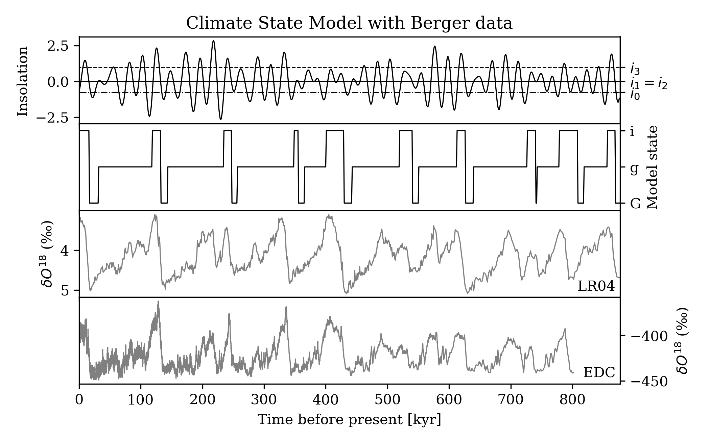
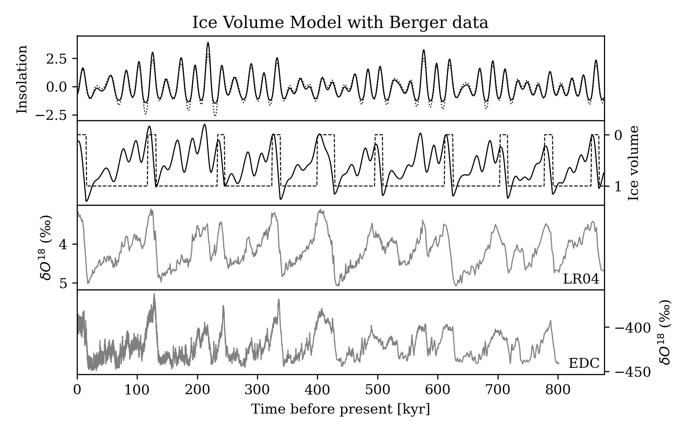
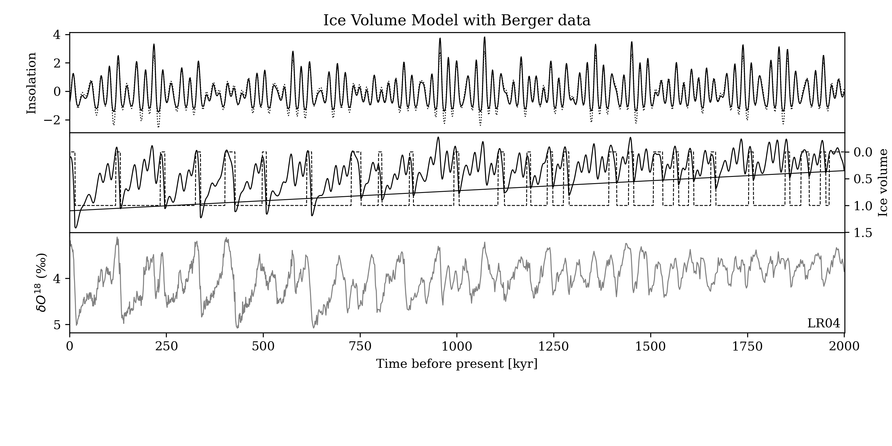

# 🧊 Glacial-Interglacial Cycles

This project implements modular models of glacial–interglacial cycles, inspired by the threshold-based framework of Paillard (1998) and extended for flexible simulation of ice volume, orbital forcing, and climate feedbacks.

Glacial–interglacial cycles of the late Pleistocene are characterized by nonlinear transitions between multiple climate states — *interglacial*, *mild glacial*, and *full glacial*. These transitions are not explained by orbital forcing alone, but can be reproduced by simple conceptual models with thresholds and memory effects.  

This simulator provides a **Python implementation** of such models for experimentation, teaching, and research.
#### Glacial state model


#### Continuous ice volume model


#### Continuous ice volume model with general cooling


---

## ✨ Features
- **Base abstraction** for glacial cycle models with state management.
- **Two core model types**:
  - **State-only model**: Implements Paillard’s 3-state threshold model without explicit ice volume dynamics.
  - **Ice-volume model**: Differential version with explicit ice volume evolution and relaxation dynamics.
- **Simulation orchestration** for running long climate histories under orbital forcing.
- **Analysis utilities**: Extract time series, states, and perform plotting.
- **Extensible design**: New models and forcings can be added modularly.

---

## 📖 Scientific background
- Implements the **multiple-state climate model** proposed by Paillard (1998, *Nature*), which successfully reproduces the timing of Pleistocene glaciations and resolves the “100 kyr problem” by invoking nonlinear thresholds rather than linear insolation forcing.
- Supports both the **discrete 3-state model** and the **continuous ice volume extension** with relaxation dynamics.
- Forcing is based on **summer solstice insolation at 65°N** (Berger 1978), preprocessed with a truncation function to reflect nonlinear ice-sheet sensitivity.
- Models are robust to parameter changes and reproduce key features such as the unusual duration of Marine Isotope Stage 11.

---

## 🚀 Installation
```bash
git clone https://github.com/carlivas/Glacial-Interglacial-Cycles
cd Glacial-Interglacial-Cycles
pip install -r requirements.txt
```

📚 References
- [Paillard, D. (1998). The timing of Pleistocene glaciations from a simple multiple-state climate model. Nature, 391, 378–381](https://github.com/carlivas/Glacial-Interglacial-Cycles/blob/main/documents/Paillard_1998_Nature.pdf)
- [Earth & Climate Physics Project Report](https://github.com/carlivas/Glacial-Interglacial-Cycles/blob/main/documents/Earth_and_Climate_Physics_Project.pdf)
